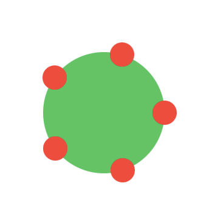
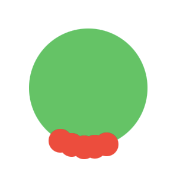
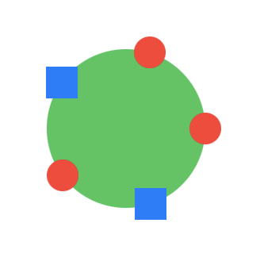
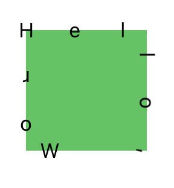

# Chris's SwiftUI StrokeExtensions

Adorn your SwiftUI Shapes/Beziers with Ornaments

This is a pure SwiftUI extension to add views along shapes.

## Features

- [x] Fast Implementation
- [x] Customizable Item Count
- [x] AnyView can be used
- [x] Custom offset position
- [x] Equal Spreading or Specified Spaced items
- [x] Fully Animatable


|        |       |
|--------|-------|
|
|


```
import StrokeExtensions

struct SwiftUIView: View {
    var body: some View {
        MyShape()
          .stroke(itemCount: 10, from: 0, spacing: 0, distribution: .evenly, direction: .forward, accuracy: 100) { index, layout in
          
            let scaled = layout.position * CGSize(width: 100, height: 100)
          
            Circle()
              .fill(Color.orange)
              .frame(width: 10, height: 10)
              .offset(x: scaled.x/2, y: scaled.y/2)
              .position(x: scaled.x/2, y: scaled.y/2)
          }
         .background(Color.red)
         .frame(width: 100, height: 100)
    }
}
```

## Text along a curve

```
import StrokeExtensions

struct SwiftUIView: View {
    var body: some View {
      MyShape()
        .stroke(itemCount: 10, spacing: 0.1, distribution: .continuous) { index, layout in
          
          let scaled = layout.position * CGSize(width: 100, height: 100)
          
          if let character = getCharacter("Chris Davis", at: index) {
            
            Text(character)
              .scaleEffect(layout.leftNormal.y < 0 ? -1 : 1)
              .rotationEffect(layout.angle)
              .offset(x: scaled.x/2, y: scaled.y/2)
              .offset(y: 5)
              .position(x: scaled.x/2, y: scaled.y/2)
            
          } else {
            EmptyView()
          }

          }
         .background(Color.red)
        .frame(width: 100, height: 100)
  }
}
```


Draw content along a bezier

```
public extension Shape {
  
  func stroke<NewContent>(itemCount: Int = 1,
                          from: CGFloat = 0,
                          spacing: CGFloat = 0,
                          distribution: Distribution = .evenly,
                          direction: Direction = .forward,
                          accuracy: UInt = 100,
                          @ViewBuilder innerContent: @escaping (Int, LayoutData) -> NewContent) -> some View where NewContent : View {}
  
}

```

Draw content along a bezier using a `Canvas` as the backing buffer

```
public extension Shape {
  
  func strokeWithCanvas<NewContent>(itemCount: Int = 1,
                                    from: CGFloat = 0,
                                    spacing: CGFloat = 0,
                                    distribution: Distribution = .evenly,
                                    direction: Direction = .forward,
                                    size: CGSize = CGSize(width: 40, height: 40),
                                    accuracy: UInt = 100,
                                    @ViewBuilder innerContent: @escaping (Int, LayoutData) -> NewContent) -> some View where NewContent : View {}
  
}
```

TODO

- backward has wrong shape on step
